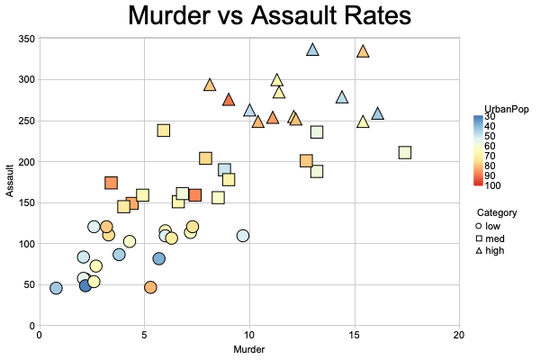
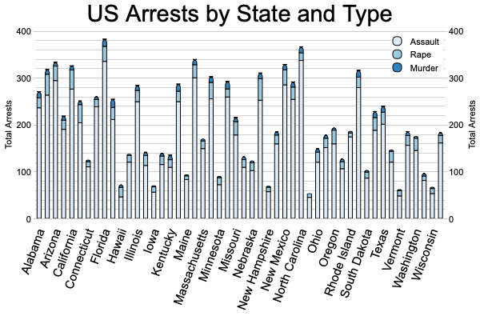

## Data from an R perspective

The canvasXpress javaScript functionality in the browser generally expects data to be in a wide format and utilizes both column- and row-names to cross-reference and access the various slices of data needed to make the charts.  The package will warn you if that data you provide doesn't match up, and it is likely that one of your structures is simply the wrong format or is missing the row or column names.


### Variables

Variables are the rows of data and the variable names are drawn from the row names.  It is helpful to keep in mind that there are a number of manipulations and functions in R that remove or reset rownames on various data structures.


### Samples

Samples are the columns of data and the sample names are drawn from the column names.  


### Annotations

Annotations are considered to be *extra* information or characteristics.  These data add to the information about samples or variables but are not a part of the main dataset.


### Item Indexing

Some charts can be built in canvasXpress based on the index of the data instead of names.  The JavaScript language uses 0-based indexing whereas the R language uses 1-based indexing.  This means that to access the first item in a vectors column, row, etc in JavaScript the index would is 0, whereas the first item in that same structure in R would have an index of 1.

This discrepancy in indexing means that when sending data indexes to canvasXpress from R it is crucial to adjust your R index (subtract 1) since the canvasXpress charts (even within RStudio) are *always* created from a JavaScript perspective.


### JSON Data (tips on matching R)

The JSON format for the data is essentially a list of lists.  From a data perspective the y list (compartment) is where the numerical data resides with three sub-lists - the names of the variables, the names of the samples, and the actual data.  The x list contains the sample annotation data, and the z list contains the variable annotation data.  

When utilizing the canvasXpress functions from R the following mappings are made, which coveres the most common charts.  There are additional named lists and properties that are mapped for specific chart types and covered with those chart examples below.

> data -> y  
> &nbsp;&nbsp;&nbsp;&nbsp;*y.vars = row names*  
> &nbsp;&nbsp;&nbsp;&nbsp;*y.smps = column names*  
> &nbsp;&nbsp;&nbsp;&nbsp;*y.data = values*  
> smpAnnot -> x  
> varAnnot -> z


## Examples

### Data Preparation

Examples here use data manipulated with the tidyverse related packages (dplyr, tibble, etc).  This is just one way to manipulate data into the correct format to plot in CanvasXpress.


A variety of commonly-used canvasXpress options are used below to provide examples of how to position, resize and configure various aspects of the charts from the call to the CanvasXpress function in R.  This includes items such as the Axis Titles, Legends, Colors, etc.  All of these optional parameters are documented on the main CanvasXpress site at http://canvasXpress.org.

```r
library(canvasXpress)
library(dplyr)
library(tibble)
library(tidyr)

data <- USArrests %>%
    rownames_to_column(var = "State") %>%
    mutate(Total = (Assault + Rape + Murder),
           Category = cut(Total, 3, 
                          labels = c("low", "med", "high"),
                          ordered_result = T)) 
```

### Scatter 2D Chart

```r
cxdata          <- data %>% select(Murder, Assault)
cxdata.varAnnot <- data %>% select(UrbanPop, Category) 

rownames(cxdata) <- data[, "State"]
rownames(cxdata.varAnnot) <- data[, "State"]

canvasXpress(data                    = cxdata,
             varAnnot                = cxdata.varAnnot,
             graphType               = "Scatter2D",
             colorBy                 = "UrbanPop",
             shapeBy                 = "Category",
             legendPosition          = "right",
             legendOrder             = list("Category" = list("low", "med", "high")),
             title                   = "Murder vs Assault Rates",
             titleScaleFontFactor    = 0.5)
```


### Stacked Bar Chart

```r
cxdata           <- t(data %>% select(Assault, Rape, Murder))
colnames(cxdata) <- data$State

canvasXpress(data                  = cxdata,
             graphType             = "Stacked",
             colorScheme           = "Blues",
             graphOrientation      = "vertical",
             legendInside          = TRUE,
             legendPosition        = "topRight",
             smpLabelRotate        = 20,
             title                 = "US Arrests by State and Type",
             titleScaleFontFactor  = 0.5,
             xAxisTitle            = "Total Arrests",
             xAxis2Title           = "Total Arrests")
```


### Clustered Bar Chart

#### CanvasXpress clustering

```r
cxdata           <- t(data %>% select(Assault, Rape, Murder))
colnames(cxdata) <- data$State

canvasXpress(data                    = cxdata,
             graphType               = "Stacked",
             graphOrientation        = "horizontal",
             colorScheme             = "Reds",
             showSampleNames         = FALSE,
             title                   = "Clustered Arrests",
             subtitle                = "(by State and Type)",
             titleScaleFontFactor    = 0.5,
             subtitleScaleFontFactor = 0.25,
             xAxisShow               = FALSE,
             xAxis2Title             = "Total Arrests",
             legendPosition          = "bottom",
             legendColumns           = 3,
#canvasXpress clustering options  
             samplesClustered        = TRUE,
             linkage                 = "single",
             distance                = "manhattan",
             smpDendrogramPosition   = "left")
```


### BoxPlot

```r
reshape <- data %>% gather(key = "Type", value = "Rate", 
                           Assault, Rape, Murder)

cxdata           <- t(reshape %>% select(Rate))
cxdata.smpAnnot  <- t(reshape %>% select(Type))

colnames(cxdata.smpAnnot) <- colnames(cxdata)

canvasXpress(data                  = cxdata,
             smpAnnot              = cxdata.smpAnnot,
             graphType             = "Boxplot",
             colorScheme           = "Pastel",
             graphOrientation      = "vertical",
             groupingFactors       = list("Type"),
             smpLabelFontStyle     = "italic",
             smpLabelRotate        = 90,
             showLegend            = FALSE,
             title                 = "US Arrests by Type",
             titleScaleFontFactor  = 0.5)
```



## Additional Information 

Additional information and many examples with R code for the ***canvasXpress*** 
library can be found at
[http://canvasxpress.org](http://canvasxpress.org).
